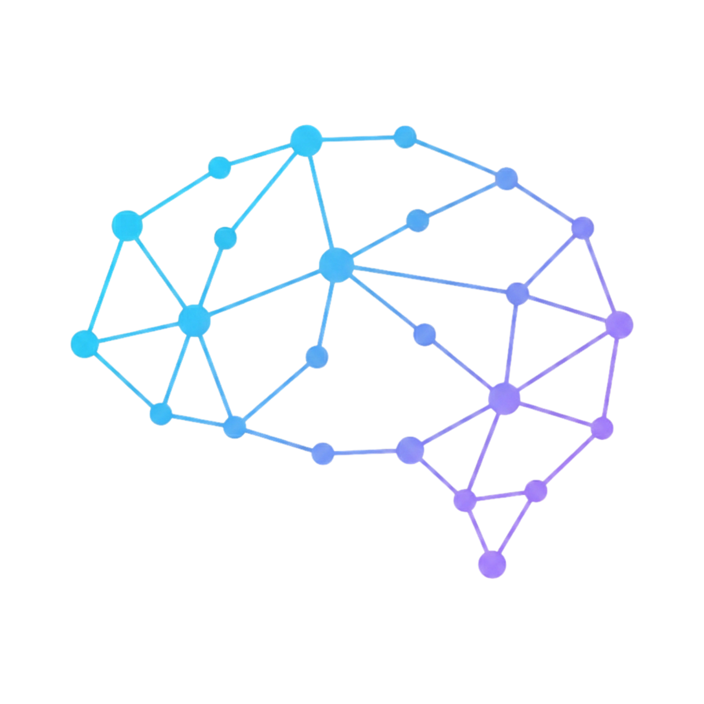

# Mindbase

<p align="center">
  
</p>

**[mindbase.one](https://mindbase.one)** · Persistent memory OS for Claude. Cross-session, cross-machine, cross-agent.

One command installs everything: Cloudflare Worker, database, CLI hooks, and a full web dashboard. Your Claude starts remembering.

```bash
npx -p mindbase mindbase-install
```

---

## What You Get

### A dashboard that shows your entire AI operation

Every project. Every agent. Every decision Claude made and why.

**Projects**: hierarchical view of everything you're working on. Memory count, task count, last session summary. Tap into any project to see the full picture.

**Inside each project:**
- **Backlog**: epics and issues with priority and status. Create inline.
- **Tasks**: pending and completed agent tasks
- **Memories**: every non-obvious decision Claude saved, tagged by category and importance. Searchable.
- **Drive**: source files you gave Claude (PDFs, specs, reference docs)
- **Artifacts**: documents Claude generated (plans, drafts, analyses). Auto-classified by Haiku on upload, no manual sorting.
- **Activity**: session log for this project

**Overview**: cross-project command centre: live agent states, recent sessions, stats, cron jobs

**Sessions panel**: full history of every session across all projects and machines

---

### Memory that survives everything

Claude forgets everything when a session ends. Mindbase doesn't.

Every time you close a session, Claude saves:
- A one-sentence summary of what was done
- Non-obvious decisions in why-format: *"chose X, why: Y, not Z because tradeoff"*
- Concrete next steps as tasks
- Agent state set to idle

Next session, Claude fetches all of that back before touching a single file.

---

### Coordination across agents

Multiple Claude sessions running simultaneously, across different machines and projects, sharing the same memory layer. One saves. Another picks it up. No manual handoff.

```
Claude (mac)  ──┐
Claude (linux) ──┤──► Mindbase ──► shared memory, tasks, projects
Claude (server)──┘
```

This is the hivemind concept: you at the centre, all your agents connected to the same mind.

---

### PM-style session lifecycle (automatic)

Mindbase writes `mind-sync` into your `~/.claude/CLAUDE.md` during install. Every Claude session from then on follows a 3-phase lifecycle without being asked:

**Open**: fetch project context → confirm outcome → flag anything more urgent → set agent working

**Mid-session**: on context compaction: push progress, pull updates from other agents, direction check

**Close**: say "close session". Claude saves everything and replies "Saved. Session closed." Nothing else.

---

## Install

### First machine (~15 minutes)

```bash
npx -p mindbase mindbase-install
```

Claude Code walks you through:
1. Cloudflare Worker + R2 bucket deployment
2. Neon PostgreSQL setup (needed for semantic vector search)
3. Secrets and database migrations
4. Auto-discovery and mapping of your existing projects
5. mind-cli build and shell profile configuration
6. mind-sync written into `~/.claude/CLAUDE.md`
7. Dashboard deployed to Cloudflare Pages

You answer a few questions. Claude does the rest.

**Prerequisites:** Claude Code CLI · Node.js 18+ · Cloudflare account (free) · Neon account (free)

### Second machine (30 seconds)

```bash
npx -p mindbase mindbase-join
```

Claude asks for your `MIND_URL` and `MIND_API_KEY`. No infra. No new accounts. Same mind, new machine.

---

## Stack

| Layer | What |
|---|---|
| API | Cloudflare Workers |
| File storage | Cloudflare R2 (Drive + Artifacts) |
| AI | Workers AI (embeddings) + Claude Haiku (artifact classification) |
| Database | Neon Postgres with pgvector (semantic memory search) |
| Dashboard | React + Vite on Cloudflare Pages |
| CLI | Node.js: `context`, `fetch`, `save` commands |

Everything except Neon runs on Cloudflare's free tier. Neon is free tier too, it's separate because Cloudflare D1 doesn't support pgvector yet.

---

## Key API Endpoints

| Endpoint | What it does |
|---|---|
| `GET /context/overview` | Session-start overview (all projects, urgent backlog, recent sessions) |
| `GET /context/project?name=X` | Full project context on demand |
| `POST /memory` | Save a memory |
| `POST /task` | Save a task |
| `POST /backlog` | Add a backlog item |
| `POST /session` | Log a session |
| `POST /agent-state` | Update live agent status |
| `POST /artifact` | Upload file metadata to Drive or Artifacts |
| `POST /artifacts/classify` | Reclassify existing artifacts with Haiku |

All requests: `Authorization: Bearer <MIND_API_KEY>`

---

## Self-Hosting

Mindbase is designed for Cloudflare but the worker is a standard fetch handler, runs anywhere that supports the [WinterCG](https://wintercg.org/) runtime. R2 can be swapped for any S3-compatible store.

See `mind-worker/wrangler.toml.example` for configuration reference.

---

## License

[PolyForm Noncommercial 1.0.0](LICENSE) — free for personal and non-commercial use. For commercial licensing, reach out on [LinkedIn](https://www.linkedin.com/in/mpbharat/).
